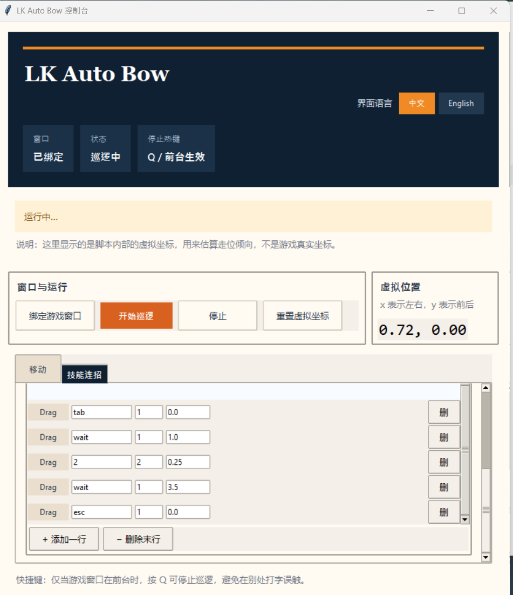

# 洛克王国刷花自动鞠躬脚本

这是一个基于 `Python + Tkinter` 的小工具，用来给洛克王国窗口发送按键，自动执行刷花、鞠躬和简单巡逻流程。



## 功能

- 绑定指定游戏窗口
- 自动巡逻
- 自定义技能连招
- 技能步骤支持拖拽排序
- 中英文界面切换
- GitHub Actions 自动打包 Windows `.exe`

## 使用方法

### 1. 安装依赖

```bash
pip install keyboard pywin32
```

### 2. 启动脚本

```bash
python lk.py
```

### 3. 绑定游戏窗口

点击 `绑定游戏窗口`，然后把鼠标移动到游戏窗口上，等待 3 秒自动绑定。

### 4. 开始运行

点击 `开始巡逻` 后，脚本会按当前参数和技能顺序执行。

### 5. 停止

当游戏窗口在前台时，按 `Q` 可以停止脚本，或者直接点击界面里的 `停止` 按钮。

## 技能连招

- 每一行代表一个步骤
- `key` 可填写 `tab`、`esc`、数字、字母等
- `wait` 表示纯等待，不发键
- 左侧 `Drag` 可拖拽调整顺序

## 打包 EXE

仓库已经带有 GitHub Actions 工作流。

- 推送到 `main` 后会自动构建
- 构建完成后可在 GitHub Actions 的 artifact 中下载 `lk_auto_bow.exe`

## 注意

- 本脚本通过向窗口发送按键实现自动化，不读取游戏真实坐标
- 请先确认绑定的是正确的游戏窗口
- 仅建议在你自己的使用场景下测试和调整参数
